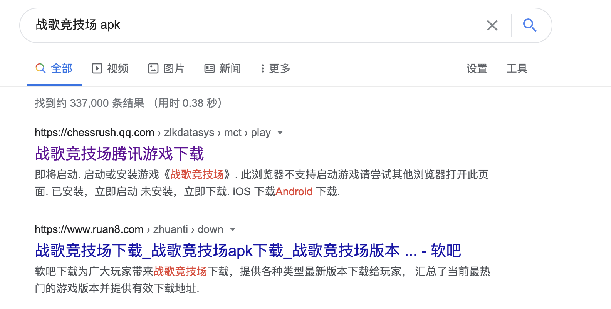

# 资源逆向
---

通俗一点讲，在本章节大家可以了解到如何从ab文件里面反编译资源，也就是从ab文件里面提取出来比较方便查看的文件格式。鉴于abtool集成了项目所有资源类型的序列化信息，理论上abtool可以反编译任意资源，但是实现所有反编译是有成本的，并且不是所有译资源都是我们关心的，所以笔者暂时只实现了优先几个但是高频、实用的资源类型的反编译，比如：贴图、模型、Shader、二进制文件等。从ab文件反编译资源并非abtool的开发初衷，但是abtool的实现原理注定它是天然支持资源逆向的，大家在接下来的案例中会看到这一点。


为了增加反编译过程真实感，笔者决定在本案例中使用第三方线上运营游戏来做演示，大家可以依照步骤得到相同的结果。

#### 下载安装包

大家可以通过Google搜索`战歌竞技场 apk`，然后下载相应的apk安装包。笔者使用的版本是`1.5.151`，点击[链接](https://dlied4.myapp.com/myapp/1109006800/cos.release-75620/10040714_com.tencent.hjzqgame_a960942_1.5.151_j2e715.apk)[^1]可直接进行下载，但是鉴于cdn链接的时效性，该文档并不保证该下载链接总是有效，如果链接失效请自行从Google搜索结果里面寻找其他可用下载链接。



#### 解压ab资源

```
unzip 10040714_com.tencent.hjzqgame_a960942_1.5.151_j2e715.apk
mv -v assets/AssetBundles/Android AssetBundles
```

上述命令可以解压apk安装包里面的所有资源，其中`AssetBundles`目录存储了游戏的ab资源，后续的资源逆向案例默认使用这些资源。

[^1]: https://dlied4.myapp.com/myapp/1109006800/cos.release-75620/10040714_com.tencent.hjzqgame_a960942_1.5.151_j2e715.apk

