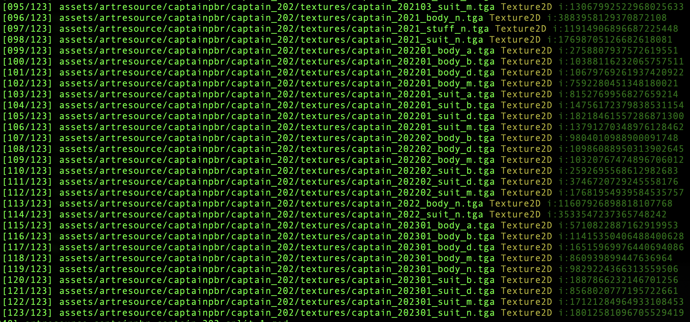
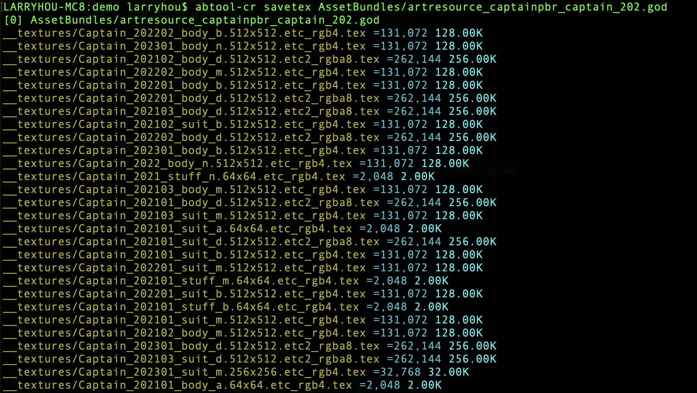
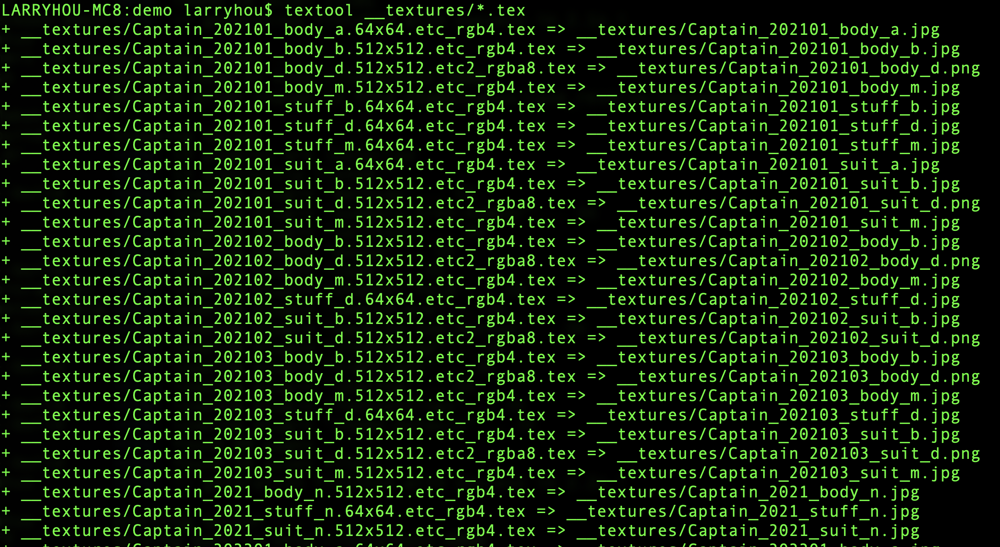
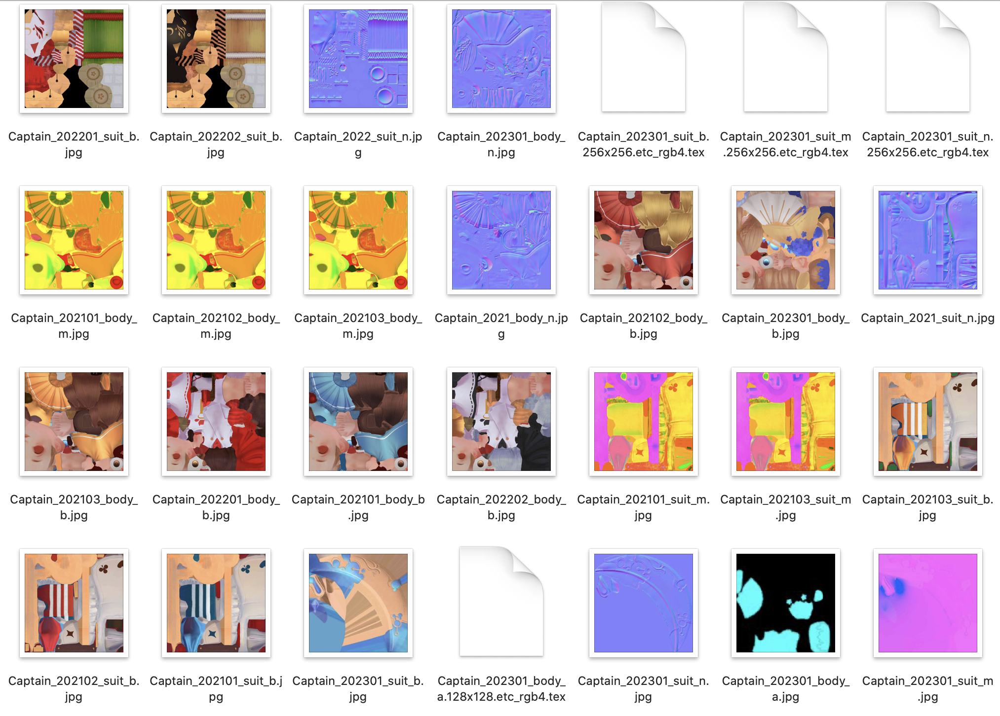

# 贴图
---

#### 选择ab文件
首先我们需要找到一个包含贴图资源的ab文件，如果您不确定是哪个ab满足要求，那么可以使用`list`命令收集所有进包的资源路径，然后反过来从贴图资源的路径查找相应的ab文件。

```bash
find AssetBundles -iname '*.god' | xargs abtool list -r
```
从结果里面我们选择`artresource_captainpbr_captain_201.god`作为演示资源。


#### 提取贴图资源

通过abtool的`savetex`命令可以一次性保存ab文件里面所有的贴图资源，默认输出到当前目录的`__textures`目录，也可以添加`--output`参数指定其他存放目录。

```bash
abtool savetex AssetBundles/artresource_captainpbr_captain_201.god
```



需要说明的是：`savetex`保存的贴图有着固定命名规范，其格式为[filename].[宽]x[高].[贴图格式].tex，除了filename，其余文件名内容是不能修改的，否则在接下来的贴图格式转码里面会失败。


#### 贴图格式转换

从上一步骤得到的贴图都是`*.tex`格式的文件，并不是我们常见的方便审阅的png或者jpg格式，它们是GPU渲染用到的贴图格式，所以还需要进行一次格式转换。在工程根目录放置了python脚本工具`textool.py`，它可以自动批量把`*.tex`文件转换成`*.png`或`*.jpg`，具体根据贴图是否包含透明通道来最终决定存储格式。

```python
import re, struct
from tex2img import decompress_astc, decompress_etc, decompress_pvrtc
from PIL import Image

def main():
    import sys
    pattern = re.compile(r'[^/]+\.(\d+x\d+)\.([^.]+)\.tex$')
    for filename in sys.argv[1:]:
        match = pattern.search(filename)
        if not match: continue
        # print('>>> {}'.format(filename))
        fp = open(filename, 'rb')
        texture_size = [int(x) for x in match.group(1).split('x')]
        texture_format = match.group(2)
        mode = 'RGBA'
        if texture_format.startswith('etc_'):
            image = decompress_etc(fp.read(), texture_size[0], texture_size[1], 0)
            mode = 'RGB'
        elif texture_format.startswith('etc2_'):
            image = decompress_etc(fp.read(), texture_size[0], texture_size[1], 3 if texture_format.startswith('etc2_rgba') else 1)
        elif texture_format.startswith('astc_rgb'):
            block_size = [int(x) for x in texture_format.split('_')[-1].split('x')]
            image = decompress_astc(fp.read(), texture_size[0], texture_size[1], block_size[0], block_size[1], False)
        elif texture_format.startswith('pvrtc'):
            # https://github.com/powervr-graphics/Native_SDK/blob/3f88b0f3735774ab9fb718da0aeadd06acf68d21/framework/PVRCore/texture/PVRTDecompress.cpp#L574
            image = decompress_pvrtc(fp.read(), texture_size[0], texture_size[1], 0 if texture_format[-1] == '4' else 1)
        elif texture_format.startswith('rgba32'):
            image = fp.read()
        elif texture_format.startswith('rgb24'):
            image = fp.read()
            mode = 'RGB'
        elif texture_format.startswith('rgb565'):
            width, height = texture_size
            image = bytearray(width * height * 3)
            index = 0
            for r in range(height):
                for c in range(width):
                    v, = struct.unpack('<H', fp.read(2))
                    image[index+0] = (v >> 11 & 0x1F) * 255 // 0x1F # red
                    image[index+1] = (v >>  5 & 0x3F) * 255 // 0x3F # green
                    image[index+2] = (v >>  0 & 0x1F) * 255 // 0x1F # blue
                    index += 3
            image = bytes(image)
            mode = 'RGB'
        elif texture_format.startswith('rgba4444'):
            width, height = texture_size
            image = bytearray(width * height * 4)
            index = 0
            for r in range(height):
                for c in range(width):
                    v, = struct.unpack('<H', fp.read(2))
                    image[index+0] = (v >> 12 & 0xF) * 255 // 0xF # red
                    image[index+1] = (v >>  8 & 0xF) * 255 // 0xF # green
                    image[index+2] = (v >>  4 & 0xF) * 255 // 0xF # blue
                    image[index+3] = (v >>  0 & 0xF) * 255 // 0xF # alpha
                    index += 4
            image = bytes(image)
        elif texture_format.startswith('alpha8'):
            image = fp.read()
            mode = 'L'
        else: continue
        result = Image.frombytes(mode, tuple(texture_size), image, 'raw')
        savename = re.sub(r'(\.[^.]+){3}$', '', filename) + '.' + ('png' if mode == 'RGBA' else 'jpg')
        result.save(savename)
        print('+ {} => {}'.format(filename, savename))

if __name__ == '__main__':
    main()
```

在使用前建议把textool放到`/usr/bin/local/`目录下，这样好处是不用每次都用一个很长的路径来访问这个工具了。

```bash
cp -fv textool.py /usr/local/bin/textool
```

接下来通过textool转换`*.tex`贴图格式，转换后的图片文件存储在源`*.tex`文件的同级目录。

```bash
textool __textures/*.tex
```



打开`__textures`目录见证奇迹时刻。



textool工具依赖第三方贴图解码库[tex2img](https://github.com/K0lb3/tex2img.git)[^1]，该工具封装了[BinomialLLC/basis_universal](https://github.com/BinomialLLC/basis_universal/)[^2]、[Ericsson/ETCPACK](https://github.com/Ericsson/ETCPACK)[^3]和[powervr-graphics/Native_SDK](https://github.com/powervr-graphics/Native_SDK/tree/master/framework/PVRCore/texture)[^4]，感谢老哥**K0lb3**提供的便利，也建议大家给他点个赞。在此基础上笔者增加了`RGBA32`、`RGBA4444`、`RGB24`、`RGB565`和`Alpha8`贴图格式的解码，经过这么一番整合，应该可以应付绝大部分的贴图转码。


[^1]: https://github.com/K0lb3/tex2img.git
[^2]: https://github.com/BinomialLLC/basis_universal/
[^3]: https://github.com/Ericsson/ETCPACK
[^4]: https://github.com/powervr-graphics/Native_SDK/tree/master/framework/PVRCore/texture


