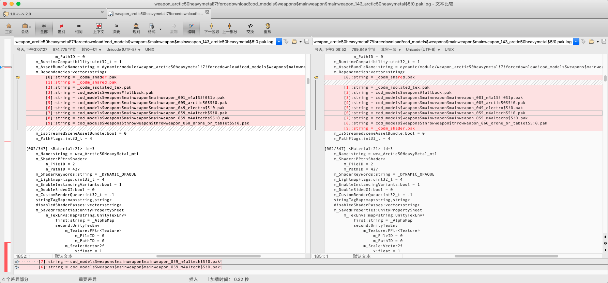
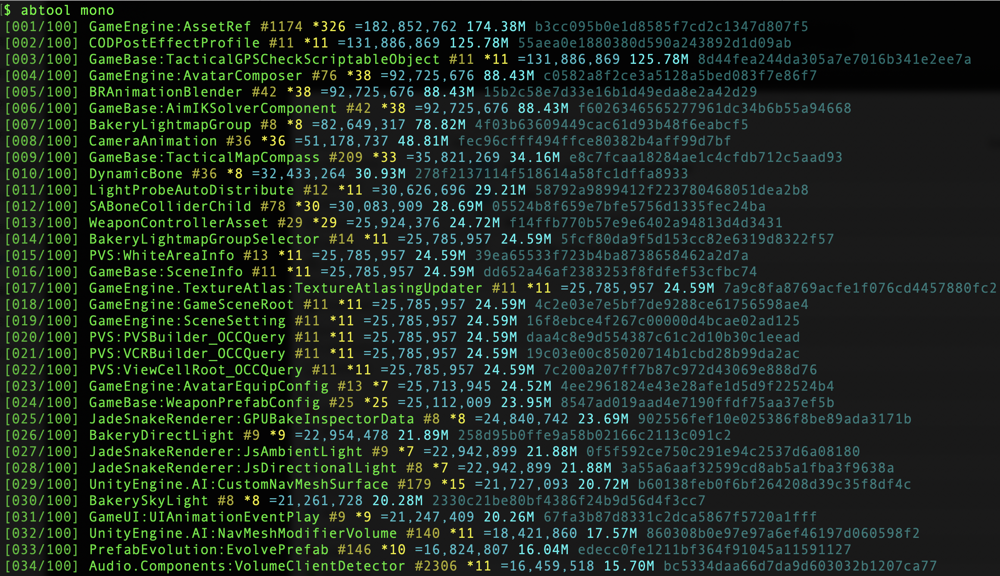

# 资源差异比对
---

跟进过Unity资源热更发布的朋友就会有感触，每次发布都会自我灵魂拷问：变更的ab资源是否都需要发布？有些资源明确没有改动，但是打出来的ab文件md5却是不同的，该怎么办？不发不放心，发了也不安心！

那么有了abtool那可就简单多了，通过`dump`命令把ab文件解压为格式整齐、开发友好的文本文件。

```bash
# 当前cd目录为ab资源存储目录
find . -iname '*.pak' | while read pak
do 
    abtool dump "${pak}" | tee "${pak}.log"
done
```

通过上面三行bash脚本可以轻松把所有的ab文件转成文本文件，然后打开BeyondCompare就一切都明了了。对于修改的资源我们会有心理预期，一般比较在意的是预期之外被修改到的资源，据笔者的经验可以大概分为一下几类：
* 依赖列表顺序
* 增删进包文件
* 动画浮点数序列化不稳定
* 修改MonoBehaviour成员变量

#### 依赖列表顺序

每个ab文件里面都有个`AssetBundle`对象，其数据结构大致如下
```c++
struct AssetBundle {
    std::string m_Name;  // 1
    std::vector<PPtr<struct Object>> m_PreloadTable;  // 2
    std::multimap<std::string,AssetInfo> m_Container;  // 3
    AssetInfo m_MainAsset;  // 4
    uint32_t m_RuntimeCompatibility;  // 5
    std::string m_AssetBundleName;  // 6
    std::vector<std::string> m_Dependencies;  // 7
    bool m_IsStreamedSceneAssetBundle;  // 8
    int32_t m_ExplicitDataLayout;  // 9
    int32_t m_PathFlags;  // 10
    std::map<std::string,std::string> m_SceneHashes;  // 11
};
```

`AssetBundle::m_Dependencies`字段存储了当前ab依赖的其他ab文件列表，Unity在打包过程中可能生成不稳定的顺序，但是列表内容相同。



#### 增删进包文件

如果生成ab文件的配置发生了变化，比如增删了文件路径，那么即使游戏资产没变的情况下也会导致ab文件最终发生变化。


#### 动画资产浮点数序列化不稳定

`AnimationClip`动画资产里面Hermite样条曲线函数很容易产生不稳定的结果，主要表现为往极大或者极小值方向变化。

```c++
struct StreamedHermiteClip {
    std::vector<uint32_t> data;  // 1
    uint32_t curveCount;  // 2
    float timeMin;  // 3
    std::vector<float> coefMin;  // 4
    float timeRange;  // 5
    std::vector<float> coefRange;  // 6
};
```


#### 修改MonoBehaviour成员变量
`MonoBehaviour`脚本在序列化的时候会把成员变量按照一定规则算出一个128位的hash值，如果修改了脚本变量那么理论上是不能够热更的，否则运行时将无法对资源进行反序列化和对象加载，一般只有商店版本发布的时候才发布修改后的脚本。


但是程序版本发布的时候，一般还会有另外一个问题



