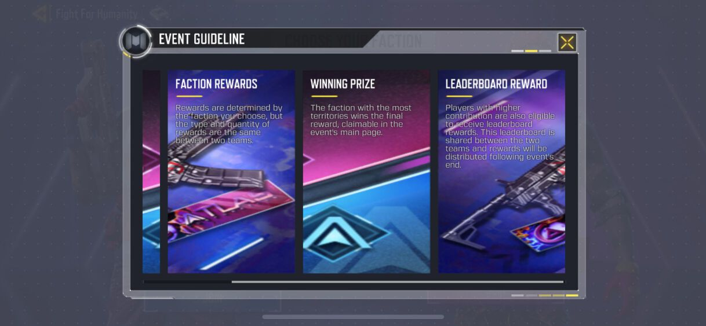

# 资源显示异常
---

某天我被拉去查一个iOS资源显示问题，如下

正常应该是这样的

从表象来看是图片被横向拉伸了，美术同学和开发同学都说资源没问题，Editor验收也正常，安卓的真机也没问题。如果是你该怎么定位这个问题？

我来定位的话，就简单多了！工具在手，首先反编译下贴图：通过`abtool savetex`得到`Update_4_1.1024x1024.pvrtc_rgba4.tex`，再用textool转码得到tga文件，下图为tga转了jpg的显示。

从结果来看，图片确实被拉伸了，原图是512x1024尺寸的，实际变成1024x1024尺寸了，这是由于PVRTC不支持长方形的贴图导致的：对于非正方形的贴图，会被PVRTC强制拉伸成正方形再进行编码。当然，最终打开Unity那一刻也确认下笔者的判断。

修复也很简单，改成ASTC格式就可以了。

