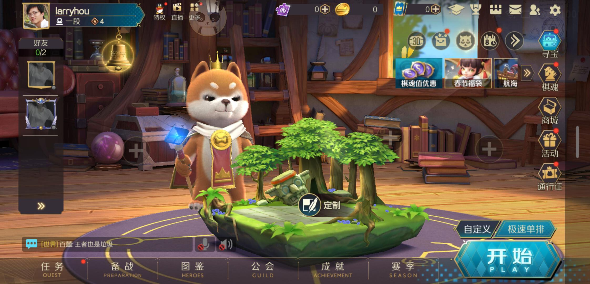
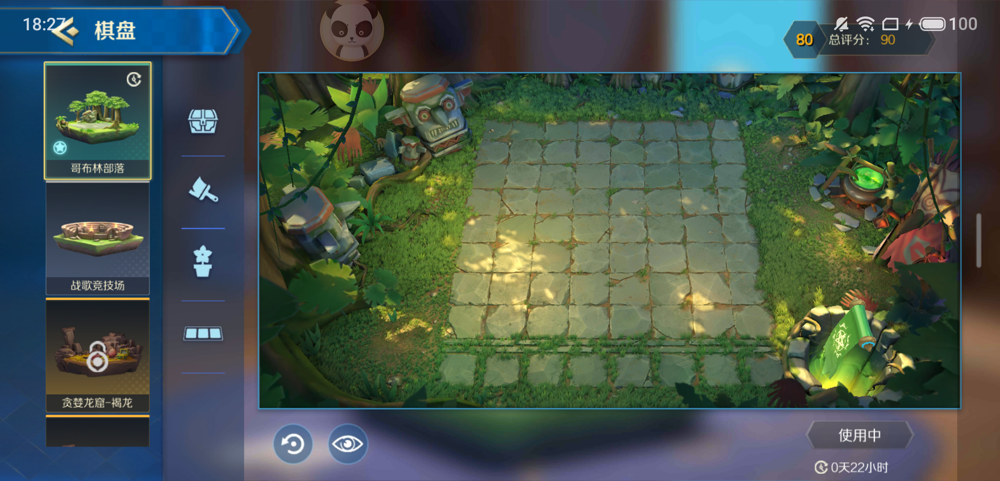
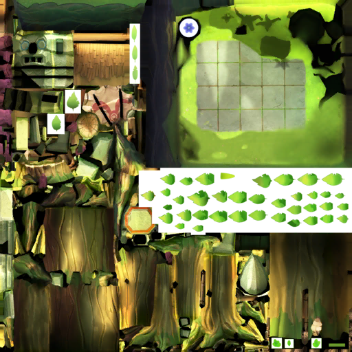
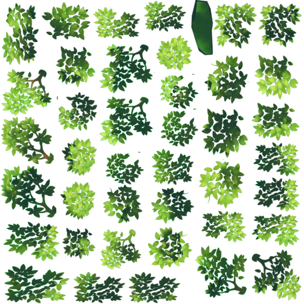
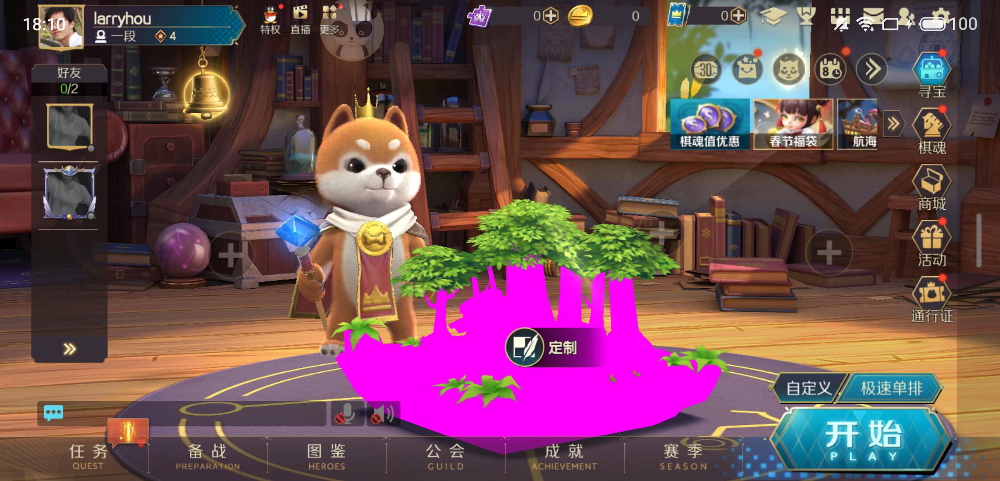

# 资源编辑
---

以下演示继续用战歌竞技场的资源，下面是游戏大厅的界面。



> 声明：本案例使用的方法以及由该方法得到的资源仅用于学习交流，请勿用于其他非法目的，否则后果自负。

笔者的目标是要把中间那个森林棋盘的Shader去掉，期望棋盘显示为紫色效果。


首先在ab资源里面找到文件`dataconfig.god`，看起像来是配置文件，通过`list`命令发里面都是二进制配置。

```
abtool list dataconfig.god
```

日志中有个`dataconfig_chess_board_model_conf.bytes`的资源看起来是棋盘相关的配置，我们通过`saveta`命令提取这些二进制配置，默认输出到`__textassets`目录。
```
abtool saveta dataconfig.god
```

尝试用`protoc`解析下发现protobuf序列化的配置文件
```
protoc --decode_raw < __textassets/dataconfig_chess_board_skin_conf.bytes | pbdecode
```

其中`pbdecode`是笔者写的一个小工具，可以把protoc打印出来的八进制编码转成UTF-8编码，主要方便查看配置中文信息，可以复制以下C++代码自行编译。

```c++
#include <assert.h>
#include <iostream>
#include <fstream>

void decode(const char *input, char *output, size_t length, bool newline = true)
{
    auto wCursor = output;
    
    auto rCursor = input;
    auto end = rCursor + length;
    while (rCursor < end)
    {
        *wCursor = *rCursor;
        if (*rCursor == '\\')
        {
            auto ptr = rCursor + 1;
            if (*ptr >= '0' && *ptr <= '9')
            {
                auto byte = 0;
                for (auto n = 0; n < 3; n++)
                {
                    byte = (byte << 3) | *ptr - '0';
                    ++ptr;
                }
                
                assert(byte <= 0xFF);
                *wCursor = static_cast<char>(byte);
                rCursor += 3;
            }
        }
        
        ++rCursor;
        ++wCursor;
    }
    
    *wCursor = 0;
    std::cout << output;
    if (newline) { std::cout << '\n'; }
    std::cout << std::flush;
}

void decode(const char *path)
{
    std::ifstream fs(path, std::ifstream::binary);
    fs.seekg(0, std::ios_base::end);
    auto length = static_cast<size_t>(fs.tellg());
    fs.seekg(0);
    
    char buffer[length];
    fs.read(buffer, length);
    fs.close();
    
    decode(buffer, buffer, length, false);
}

int main(int argc, const char * argv[])
{
    if (argc > 1)
    {
        for (auto i = 1; i < argc; i++)
        {
            decode(argv[i]);
        }
    }
    else
    {
        std::string pipe;
        while (std::getline(std::cin, pipe))
        {
            auto size = pipe.size();
            
            char buffer[size];
            decode(pipe.c_str(), buffer, size);
        }
    }
    
    return 0;
}

```
然后打开棋盘弹窗，在这里我们知道棋盘的名字叫`哥布林部落`



同时我们从刚刚解开的配置里面确实找到了相关数据
```
1 {
  1: 18
  2: "哥布林部落"
  3: "Prefabs/Environment/ChessBoard/ChessBoard_01"
  4: "Scene_Goblin"
  5: "DataConfig/CardPoolMat/img_game_chessshop_bg"
  6: "Prefabs/Environment/Scene/SmallChessBoard/Small_Goblin_01"
  7: 13
  8: 101
  9: 10501
  10: 1002
  11: 1001
  12: 1003
  14: "map_11_goblin.bnk"
  15: 9027
  17: 1
  18: 1541462414
  19: 1762473614
  20: 58
  21: 0
  22: 60
}
```

从配置知道这个棋盘的资源名大概是`Small_Goblin_01`，下面通过`list`命令穷举所有资源列表。

```
find . -iname '*.god' | xargs abtool list -r
```

通过关键字`Small_Goblin_01`搜索，发现文件名为`artresource_environment_scene_logicmesh_small_checkerboard.god`的ab可能是我们要找的目标。


但现在还不是特别确定，所以可以先把资源反编译出来确认下，这里使用`savetex`保存ab里面的贴图，并用`textool`转码贴图文件，然后可以很容易发现，下面这两张贴图可以确认是大厅棋盘使用的。

棋盘树干以及底座的贴图，从这里看出来棋盘的光照是假光照，烘焙到贴图里面了



棋盘的树叶部分贴图



接下来我们选择与贴图同名的`looby_goblin_checkerboard_01.tga`材质球`looby_goblin_checkerboard_01.mat`作为切入点，它的资源ID为`7397932659350227505`，剩下的工作就交给`edit`命令来实现了。

```
abtool edit artresource_environment_scene_logicmesh_small_checkerboard.god
```

通过上面命令进入交互模式，这里可以执行lua代码，依次输入以下命令得到编辑后的ab文件。

```
lua so = file:find(7397932659350227505)
lua ptr = castMaterial(so.object)
lua mat = ptr:get()
mat.m_Shader.m_PathID = 0
mat.m_Shader.m_FileID = 0
save
```

上面的代码每输入一行都要按一次回车键，最终结果是棋盘材质球的Shader引用置空了，最后的`save`命令会把修改后的ab文件保存到`__archives`目录，然后把里面的ab文件`adb push`到游戏的外存储目录，因为一般的热更逻辑是先读外存储的资源，外存储没有才会读安装包里面的资源，这个设计的目的是支持游戏热更。

见证奇迹时刻



上面`edit`模式需要手动码字，如果需要多次运行的时候就会显得不太方便，那么可以在当前cd目录写一个lua脚本`abtool.lua`。

```lua
-- 通过m_PathID查找SerializedObject对象
trace('原始材质球')
so = file:find(7397932659350227505)
-- 打印原始材质
file:dump_object(7397932659350227505)
-- 类型转换
ptr = castMaterial(so.object) -- std::shared_ptr<Material>
-- 获取材质球对象引用
mat = ptr:get() -- Material*
-- 设置材质的Shader为空引用
mat.m_Shader.m_PathID = 0
mat.m_Shader.m_FileID = 0
-- 打印修改后材质
trace('修改后材质球')
file:dump_object(7397932659350227505)
-- 保存当前修改
builder = assetbundle.ArchiveFileBuilder(archive) -- assetbundle::ArchiveFileBuilder
builder:save("hijack/artresource_environment_scene_logicmesh_small_checkerboard.god")
```

然后通过`lua`命令来执行这个脚本。

```bash
# 需要把abtool.lua脚本放到当前cd目录
abtool lua artresource_environment_scene_logicmesh_small_checkerboard.god 
```

最终在lua脚本指定的保存目录生成编辑后的ab文件。

当然，这个演示的目的不是教大家hack别人的游戏，由于abtool的这个能力，我们可以通过修改资源快速验证一些想法而不用构建资源包，比如测试发现资源bug，通过abtool快速修复验证，当然前提是你对abtool有一定的熟悉。


