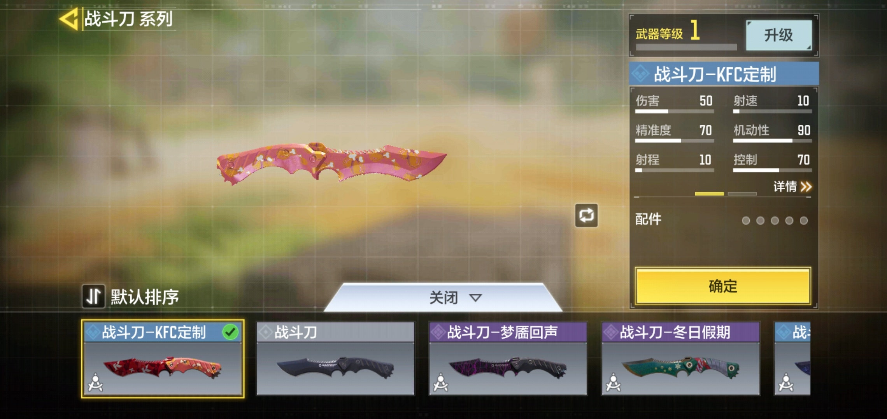
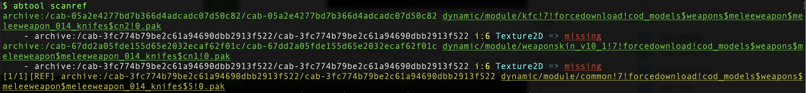
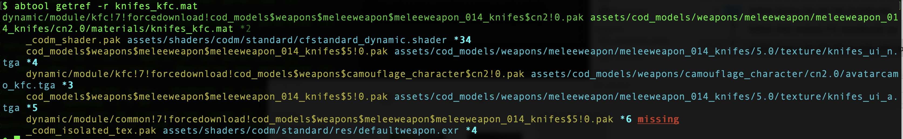

# 资源引用丢失
---

在增量编译过程中如果Unity闪退了，除了会产生导致崩溃的问题资源，也会导致一些不那么严重、但是非常奇怪的渲染结果：屏幕渲染出现紫块或者渲染效果异常，通过`scanref`也可以发现问题。

比如上次我们制作了一把KFC主题的战斗刀，Editor里面看到是正常的


但是真机运行的时候就比较奇怪了，明显刀刃的贴图错了，并且刀把的质感也不是特别好。


这种情况下使用`scanref`检查一遍资源引用，发现了问题
```
find . -iname '*.pak' | xargs abtool scanref
```


从日志看，资源`dynamic/module/kfc!7!forcedownload!cod_models$weapons$meleeweapon$meleeweapon_014_knifes$cn2!0.pak`引用了另外一个ab资源`dynamic/module/common!7!forcedownload!cod_models$weapons$meleeweapon$meleeweapon_014_knifes$5!0.pak`里面索引为`6`贴图，但是后者资源里面并没有这个贴图，那么这种情况需要把资源`dynamic/module/common!7!forcedownload!cod_models$weapons$meleeweapon$meleeweapon_014_knifes$5!0.pak`从构建机删掉重新打包。

定位这个问题，还可以从另外一个角度入手。首先通过`saveobj`命令保存资源的基本信息。
```
find . -iname '*.pak' | xargs abtool saveobj
```
然后通过`getref -r`命令直接查找出问题的材质球引用的资源列表，其中`-r`参数表示查找逆向下游资源的引用列表，没有`-r`参数情况下该命令查找当前资源的上游引用列表。



那么也能发现`KnifeS_KFC.mat`引用第五个贴图在目标资源`dynamic/module/common!7!forcedownload!cod_models$weapons$meleeweapon$meleeweapon_014_knifes$5!0.pak`里面找不到，两种方法得到同样结果。

上面被丢失的资源是贴图，如果丢失的资源是材质球，那么就会表现为屏幕紫块，定位方式类似。需要说明的是，上面提到的资源引用丢失问题指的是资源引用在，但是目标资源不存在的情况，如果原始资源引用指针为空，那么这种问题在开发阶段阶段就能发现，当然工具也能发现引用为空的情况。

为了确认资源指针是否为空，我们需要用到另外一个命令`edit`

```
abtool edit dynamic/module/kfc\!7\!forcedownload\!cod_models\$weapons\$meleeweapon\$meleeweapon_014_knifes\$cn2\!0.pak 
```
然后进入命令行交互模式，在这种模式可以执行`lua`脚本，比如可以输入`lua file:dump_object(2)`，其中`2`为`KnifeS_KFC.mat`的资源索引，通过`getref`命令得到的。
```c++
$ lua file:dump_object(2)
<Material:21> id=2
    m_Name:string = KnifeS_KFC
    m_Shader:PPtr<Shader>
        m_FileID = 5
        m_PathID = 34
    m_ShaderKeywords:string = _DYNAMIC_ADVANCE_DETAIL_LERP
    m_LightmapFlags:uint32_t = 4
    m_EnableInstancingVariants:bool = 1
    m_DoubleSidedGI:bool = 0
    m_CustomRenderQueue:int32_t = -1
    stringTagMap:map<string,string>
    disabledShaderPasses:vector<string>
    m_SavedProperties:UnityPropertySheet
        m_TexEnvs:map<string,UnityTexEnv>
            first:string = _AlphaMap
            second:UnityTexEnv
                m_Texture:PPtr<Texture>
                    m_FileID = 0
                    m_PathID = 0
                m_Scale:Vector2f
                    x:float = 1
                    y:float = 1
                m_Offset:Vector2f
                    x:float = 0
                    y:float = 0
            first:string = _BentNormalMap
            second:UnityTexEnv
                m_Texture:PPtr<Texture>
                    m_FileID = 0
                    m_PathID = 0
                m_Scale:Vector2f
                    x:float = 1
                    y:float = 1
                m_Offset:Vector2f
                    x:float = 0
                    y:float = 0
            first:string = _BumpMapPakced
            second:UnityTexEnv
                m_Texture:PPtr<Texture>
                    m_FileID = 1
                    m_PathID = 4
                m_Scale:Vector2f
                    x:float = 1
                    y:float = 1
                m_Offset:Vector2f
                    x:float = 0
                    y:float = 0
            first:string = _CutRimTex
            second:UnityTexEnv
                m_Texture:PPtr<Texture>
                    m_FileID = 0
                    m_PathID = 0
                m_Scale:Vector2f
                    x:float = 1
                    y:float = 1
                m_Offset:Vector2f
                    x:float = 0
                    y:float = 0
            first:string = _DetailAlbedoMap
            second:UnityTexEnv
                m_Texture:PPtr<Texture>
                    m_FileID = 4
                    m_PathID = 3
                m_Scale:Vector2f
                    x:float = 3
                    y:float = 3
                m_Offset:Vector2f
                    x:float = -0.15
                    y:float = 0.8
            first:string = _DetailNormalMap
            second:UnityTexEnv
                m_Texture:PPtr<Texture>
                    m_FileID = 0
                    m_PathID = 0
                m_Scale:Vector2f
                    x:float = 1
                    y:float = 1
                m_Offset:Vector2f
                    x:float = 0
                    y:float = 0
            first:string = _EmissionMap
            second:UnityTexEnv
                m_Texture:PPtr<Texture>
                    m_FileID = 0
                    m_PathID = 0
                m_Scale:Vector2f
                    x:float = 1
                    y:float = 1
                m_Offset:Vector2f
                    x:float = 0
                    y:float = 0
            first:string = _HeightMap
            second:UnityTexEnv
                m_Texture:PPtr<Texture>
                    m_FileID = 0
                    m_PathID = 0
                m_Scale:Vector2f
                    x:float = 1
                    y:float = 1
                m_Offset:Vector2f
                    x:float = 0
                    y:float = 0
            first:string = _MainTex
            second:UnityTexEnv
                m_Texture:PPtr<Texture>
                    m_FileID = 1
                    m_PathID = 5
                m_Scale:Vector2f
                    x:float = 1
                    y:float = 1
                m_Offset:Vector2f
                    x:float = 0
                    y:float = 0
            first:string = _MetallicRoughnessMap
            second:UnityTexEnv
                m_Texture:PPtr<Texture>
                    m_FileID = 2
                    m_PathID = 6
                m_Scale:Vector2f
                    x:float = 1
                    y:float = 1
                m_Offset:Vector2f
                    x:float = 0
                    y:float = 0
            first:string = custom_IBLCubemap
            second:UnityTexEnv
                m_Texture:PPtr<Texture>
                    m_FileID = 3
                    m_PathID = 4
                m_Scale:Vector2f
                    x:float = 1
                    y:float = 1
                m_Offset:Vector2f
                    x:float = 0
                    y:float = 0
```

在Unity资源里面通过`PPtr<T>`表示一个资源引用，比如，上面丢失的`_MetallicRoughnessMap`贴图，它的指针有两个字段：`m_FileID`表示目标资源的文件索引，`m_PathID`表示目标资源在目标文件里面的资源索引ID，其中`m_FileID`可以通过`SerializedFile`的metadata里面可以索引到一个全局唯一的路径`archive:/cab-3fc774b79be2c61a94690dbb2913f522/cab-3fc774b79be2c61a94690dbb2913f522`，这样通过`m_FileID`和`m_PathID`两个字段可以全局确定一个唯一的资源对象。
```c++
first:string = _MetallicRoughnessMap
second:UnityTexEnv
    m_Texture:PPtr<Texture>
        m_FileID = 2
        m_PathID = 6
```
`m_FileID=0`表示当前资源指针指向当前文件内的资源对象，`m_PathID=0`表示当前资源指针为空，这时通过Unity的Inspector可以看到资源的槽位是空的，所以如果发现某个资源指针的`m_PathID=0`那么这就是一个资源空引用案例，如下所示。

```c++
first:string = _HeightMap
second:UnityTexEnv
    m_Texture:PPtr<Texture>
        m_FileID = 0
        m_PathID = 0
```
