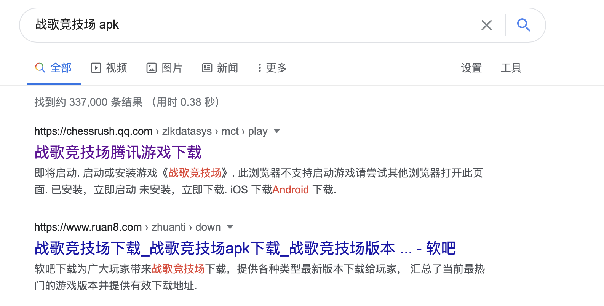

# 资源逆向
---

资源逆向既是通常意义的资源反编译，也就是从ab文件里面提取出来方便浏览的资源。鉴于abtool集成了项目所有资源类型的序列化信息，理论上abtool可以反编译任意资源，但是实现情况是反编译所有资源有代价，并且也不是所有资源都是我们关心的，所以笔者暂时只实现了有限几个但高频使用的资源类型的反编译，比如：贴图、模型、Shader、二进制文件等。从ab文件反编译资源并非abtool的开发初衷，但是abtool的实现原理注定它可以轻松支持资源逆向目的。

为了增加abtool资源逆向功能的一般性，笔者选择在本案例中使用第三方线上运营游戏来做演示，大家可以依照步骤得到相同的结果。

> 声明：本案例使用的方法以及由该方法得到的资源仅用于学习交流，请勿用于其他非法目的，否则后果自负。

#### 下载安装包

我们可以通过Google搜索`战歌竞技场 apk`，然后下载相应的apk安装包。笔者使用的版本是`1.5.151`，点击[链接](https://dlied4.myapp.com/myapp/1109006800/cos.release-75620/10040714_com.tencent.hjzqgame_a960942_1.5.151_j2e715.apk)[^1]可直接进行下载，但是鉴于cdn链接的时效性，该文档并不保证该下载链接总是有效可用，如果下载失败请自行从Google搜索结果里面寻找其他链接进行下载。



#### 解压ab资源

首先，用unzip命令行查看apk资源列表
```bash
unzip -l 10040714_com.tencent.hjzqgame_a960942_1.5.151_j2e715.apk
```

从日志里面我们发现`assets/AssetBundles`目录存储了ab资源，现在我们可以继续用unzip提取ab资源

```bash
unzip -o 10040714_com.tencent.hjzqgame_a960942_1.5.151_j2e715.apk 'assets/AssetBundles/*'
cd assets
```

这样我们就得到了apk里面所有的ab资源，在后续资源资源逆向案例中如无特殊说明，均把解压出来的assets目录作为工具的工作空间，并默认使用AssetBundles目录里面的ab资源做演示。

#### 编译

我们在前面章节已经学习了工具编译过程，由于该案例用到的ab资源属于某个特定Unity版本，所以需要依据编译流程手机资源TypeTree并重新编译abtool，否则你将无法正常通过abtool进行后续的资源逆向操作。

```bash
find . -iname '*.god' | xargs abtool savetree
```

[^1]: https://dlied4.myapp.com/myapp/1109006800/cos.release-75620/10040714_com.tencent.hjzqgame_a960942_1.5.151_j2e715.apk

