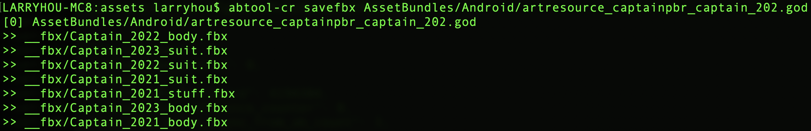
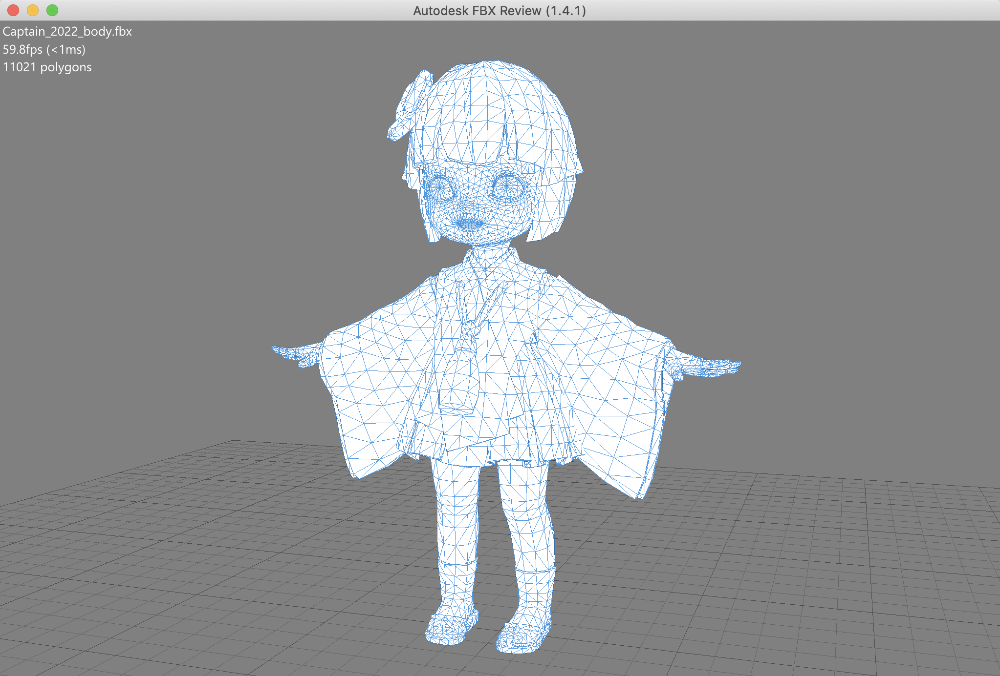
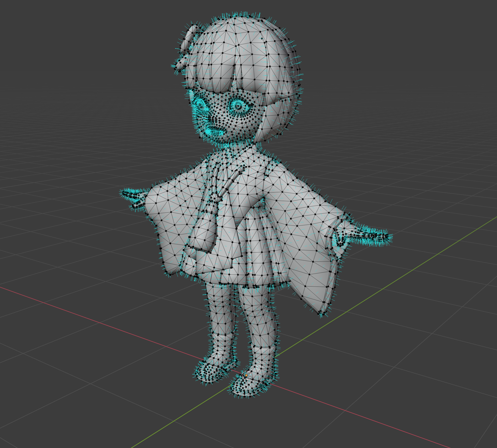
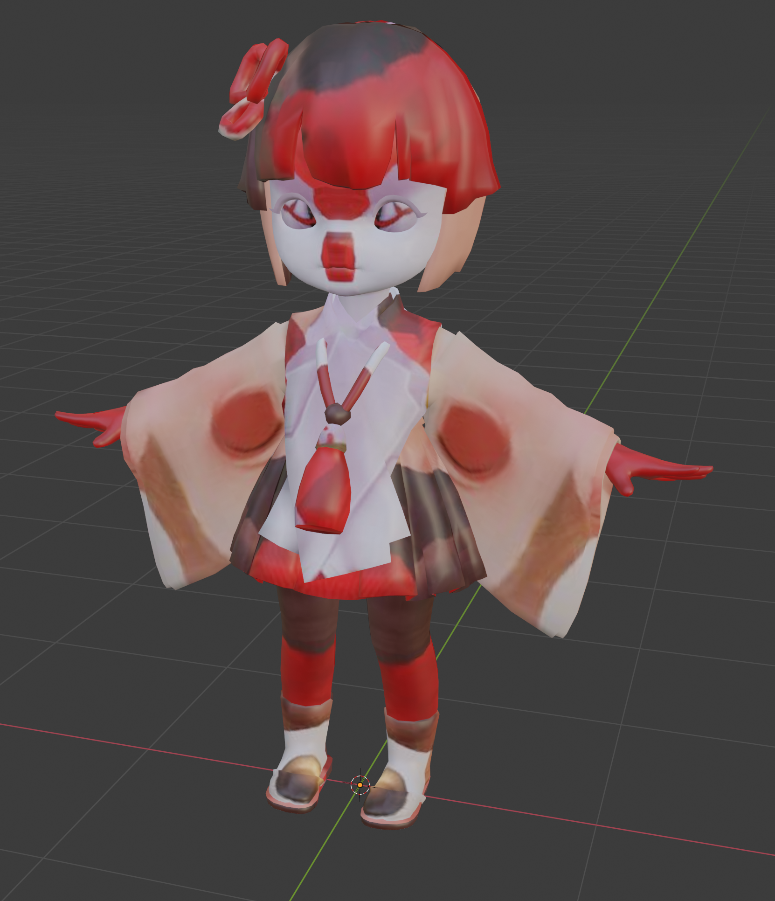
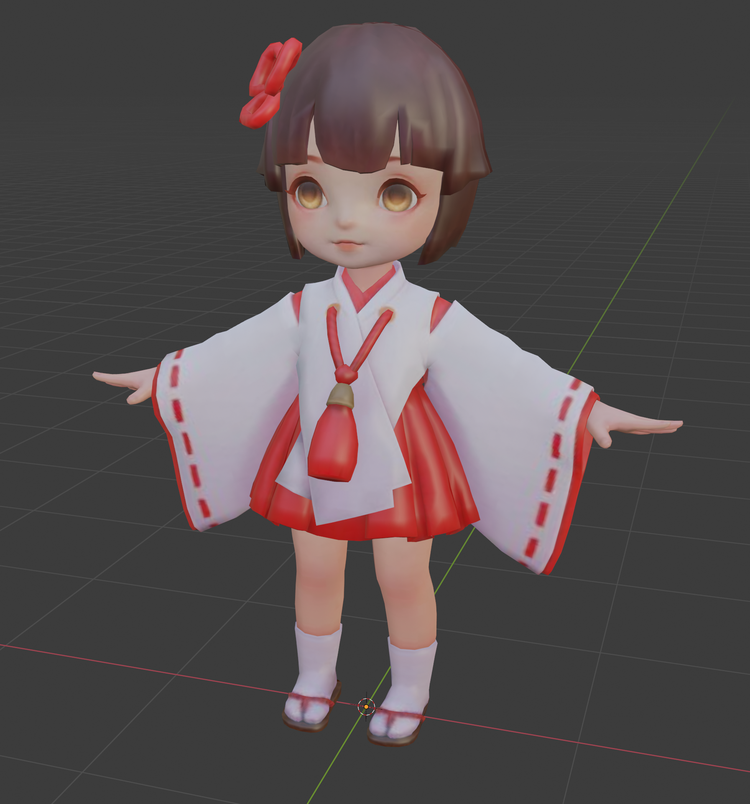

# 模型
---

在该案里面我们继续使用`artresource_captainpbr_captain_202.god`文件来演示，相比贴图逆向，模型逆向就简单多了，一行命令就可以把ab资源里面的模型导出为`*.fbx`文件。

```bash
$ abtool savefbx AssetBundles/Android/artresource_captainpbr_captain_202.god
```



FBX文件可以通过[Autodesk FBX Review](https://www.autodesk.com/products/fbx/fbx-review)[^1]打开



也可以用其他3D工具打开，比如我们可以在Blender里面查看模型的法线、UVs等信息。



结合贴图逆向得到的贴图，那么我们可以尝试用基础贴图`Captain_202201_body_b.tga`简单渲染一下。



呃，跟预期的好像不太一样，这简直像鬼一样……别着急，把贴图上下翻转下就能正常显示了。




[^1]: https://www.autodesk.com/products/fbx/fbx-review
