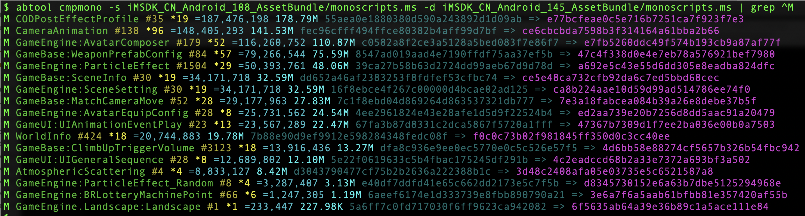

# cmpmono
---

#### 用途

`cmpmono`通过对比两个`monoscripts.ms`文件生成因`MonoBehaviour`修改导致的资源变化报告。

#### 参数

|参数|缩写|描述|
|:-|:-:|:-|
|--source|-s|`monoscripts.ms`基线文件|
|--destination|-d|`monoscripts.ms`对比文件|

#### 示例

```bash
abtool cmpmono -s iMSDK_CN_Android_108_AssetBundle/monoscripts.ms -d iMSDK_CN_Android_145_AssetBundle/monoscripts.ms | grep ^M
```
命令添加管道`grep ^M`是为了过滤脚本修改的部分，其中`A`开头的日志表示新增的脚本。



从日志可以看出，由于`CODPostEffectProfile`脚本的修改导致`178.79M`的ab资源在新的版本里面发生了变化。

