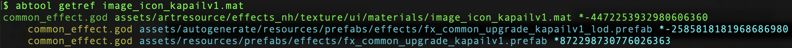

# getref
---

#### 用途

`getref`加载`saveobj`生成的数据并通过文件名查找资源对象的上下游引用关系。

#### 参数

|参数|缩写|描述|
|:-|:-:|:-|
|--artifact|-a|文件的存储路径，默认：`objects.obj`|
|--reverse|-r|反向查找下游资源引用开关|

#### 示例

```bash
abtool getref image_icon_kapailv1.mat
```



从日志可以看出材质球`image_icon_kapailv1.mat`被两个prefab引用：
1. assets/autogenerate/resources/prefabs/effects/fx_common_upgrade_kapailv1_lod.prefab
2. assets/resources/prefabs/effects/fx_common_upgrade_kapailv1.prefab

> `*-2585818181968686980`为资源`fx_common_upgrade_kapailv1_lod.prefab`在ab资源`common_effect.god`中的`m_PathID`。

添加`-r`参数可以查找被材质球`image_icon_kapailv1.mat`引用的资源

从日志可以看出材质球`image_icon_kapailv1.mat`引用了一个shader和一个张贴图。

