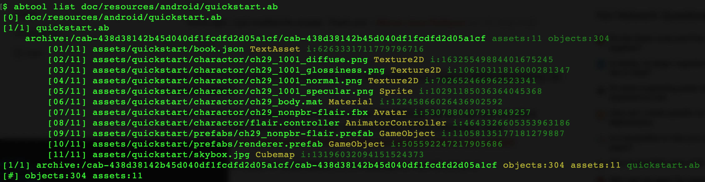
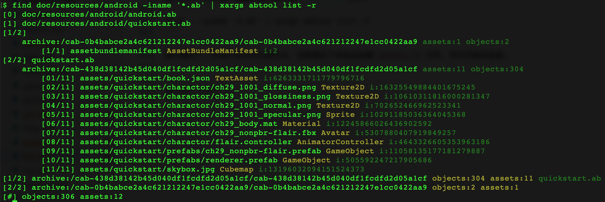
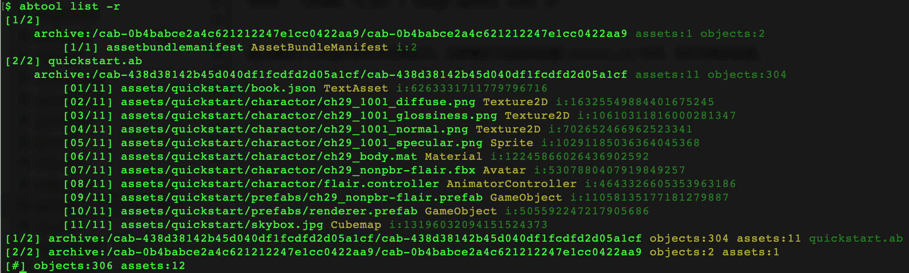

# list
---

#### 用途

`list`统计ab文件包含的资源路径列表以及对象数量，在接力模式下会把相应数据缓存到当前目录的`assets.ls`文件。

#### 参数

|参数|缩写|描述|
|:-|:-:|:-|
|--enable-relay|-r|接力模式开关|
|--artifact|-a|缓存数据文件路径，尽在接力模式下有效，默认：`assets.ls`|

#### 示例

```bash
abtool list doc/resources/android/quickstart.ab
```



接力模式下执行后，在当前目录会得到`assets.ls`文件。
```
find doc/resources/android -iname '*.ab' | xargs abtool list -r
```



接力模式下二次运行命令可以简化为`abtool list -r`，当前模式下会自动加载`assets.ls`文件，并打印相关信息。

```
abtool list -r
```




