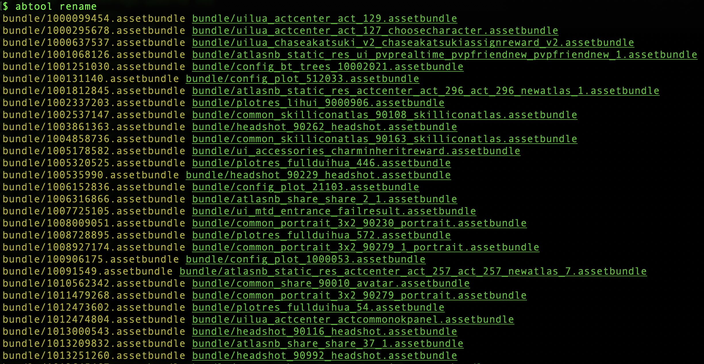
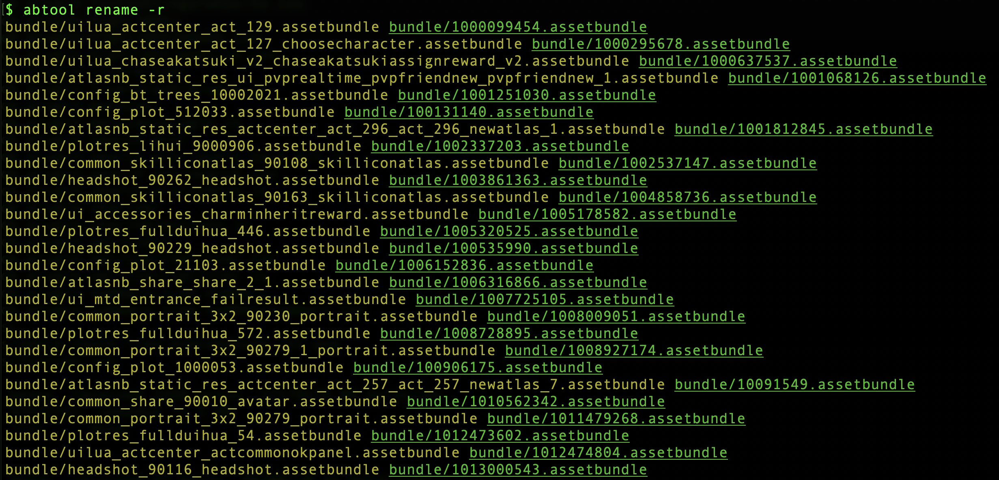

# rename
---

#### 用途

`rename`收集ab文件名与`AssetBundle::m_Name`的映射关系，并把收集到的数据缓存当前cd目录的`names.map`文件。同时还可以用`AssetBundle::m_Name`重命名当前文件名，主要用来修复ab文件名，因为有些游戏会加密混淆文件名。

#### 参数

|参数|缩写|描述|
|:-|:-:|:-|
|--artifact|-a|缓存文件的存储路径，默认：`names.map`|
|--dry-run|-d|只收集数据而不进行重命名操作|
|--reverse|-r|反向重命名|

`rename`每次运行时会自动通过`-a`指定的路径读取文件保存路径，并把二次运行得到的数据与缓存数据进行合并，然后在运行结束后把最终的数据存储到参数`-a`指定的路径。

#### 示例

```bash
find . -iname '*.assetbundle' | xargs abtool rename
```

再次运行命令时可以简化为`abtool rename`，当前模式下会自动加载`names.map`文件，并打印相关信息。



参数`-r`可以修复后的文件名还原为原始的文件名，如下



