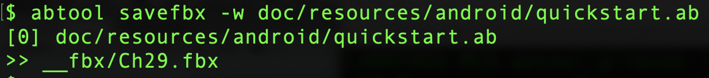
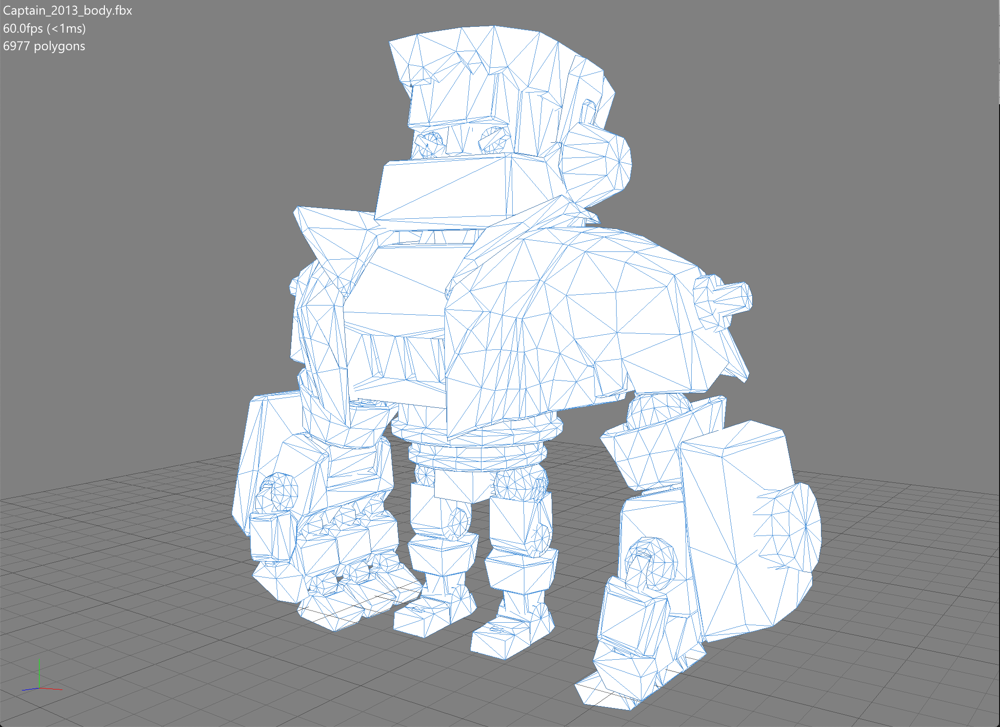

# savefbx
---

#### 用途

`savefbx`命令扫描ab文件里面所有`Mesh`资源对象并保存为`*.fbx`文件，用`Mesh::m_Name`作为文件名。需要注意的是，该命令从`Mesh::m_CompressedMesh`字段提取模型数据，如果该字段没有包含有效模型数据，最终保存的文件可能无效。

```c++
struct Mesh: public Object {
    std::string m_Name;  // 1
    std::vector<SubMesh> m_SubMeshes;  // 2
    BlendShapeData m_Shapes;  // 3
    std::vector<Matrix4x4f> m_BindPose;  // 4
    std::vector<uint32_t> m_BoneNameHashes;  // 5
    uint32_t m_RootBoneNameHash;  // 6
    uint8_t m_MeshCompression;  // 7
    bool m_IsReadable;  // 8
    bool m_KeepVertices;  // 9
    bool m_KeepIndices;  // 10
    int32_t m_IndexFormat;  // 11
    std::vector<uint8_t> m_IndexBuffer;  // 12
    std::vector<BoneWeights4> m_Skin;  // 13
    VertexData m_VertexData;  // 14
    CompressedMesh m_CompressedMesh;  // 15
    AABB m_LocalAABB;  // 16
    int32_t m_MeshUsageFlags;  // 17
    std::vector<uint8_t> m_BakedConvexCollisionMesh;  // 18
    std::vector<uint8_t> m_BakedTriangleCollisionMesh;  // 19
};
```

#### 参数

|参数|缩写|描述|
|:-|:-:|:-|
|--axis-rotate-enabled|-r|沿X轴逆时针旋转模型90°开关|
|--output|-o|`*.fbx`文件输出目录，默认：`__fbx`|
|--rewritable|-w|文件保存覆盖开关|
|--skeleton-enabled|-s|保存文件包含骨骼蒙皮信息开关|

#### 示例

```
abtool savefbx Android/artresource_captainpbr_captain_201.god
```




