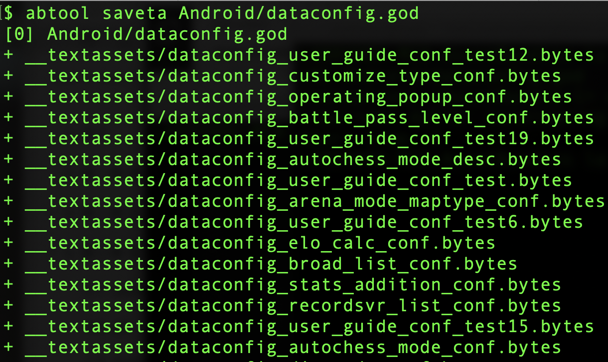

# saveta
---

#### 用途

`saveta`命令扫描ab文件里面所有`TextAsset`资源对象并保存到当前cd目录的`__textassets`目录。


#### 参数

|参数|缩写|描述|
|:-|:-:|:-|
|--output|-o|文件输出目录，默认：`__textassets`|

#### 示例

```
abtool saveta Android/dataconfig.god 
```



