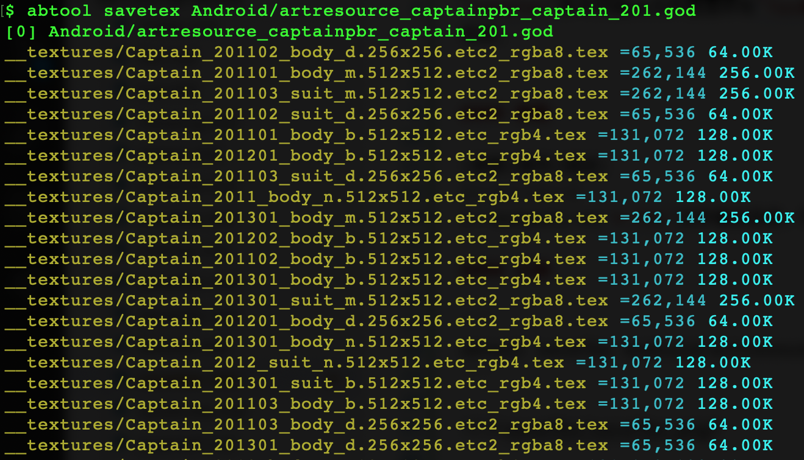
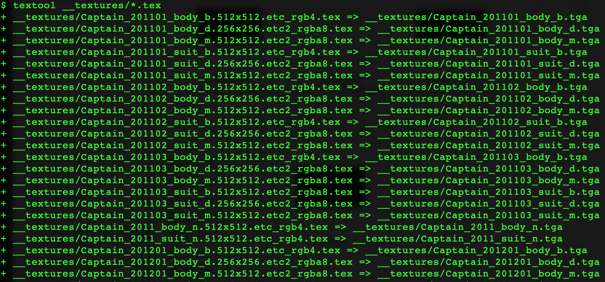
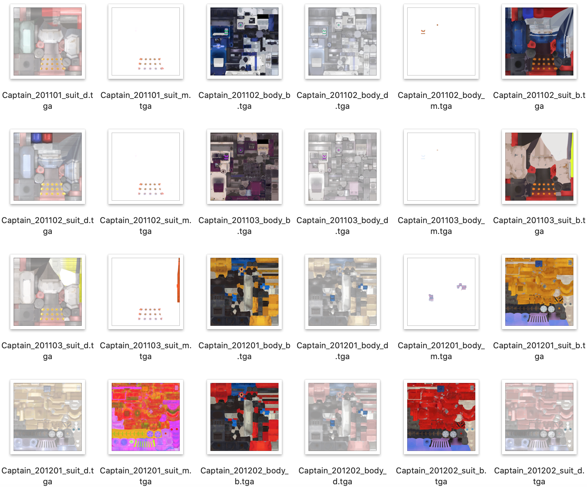

# savetex
---

#### 用途

`savetex`命令扫描ab文件里面所有`Texture2D`资源对象并保存为`*.tex`文件，用`Texture2D::m_Name`作为文件名前缀，同时追加贴图尺寸以及格式信息。


#### 参数

|参数|缩写|描述|
|:-|:-:|:-|
|--output|-o|`*.tex`文件输出目录，默认：`__textures`|

#### 示例

```
abtool savetex Android/artresource_captainpbr_captain_201.god
```



由于`savetex`提取出来贴图都是非常见编码格式，通常需要配合工程根目录的python工具`textool`一起使用，主要作用是把贴图转码为`TGA`格式，如下。





