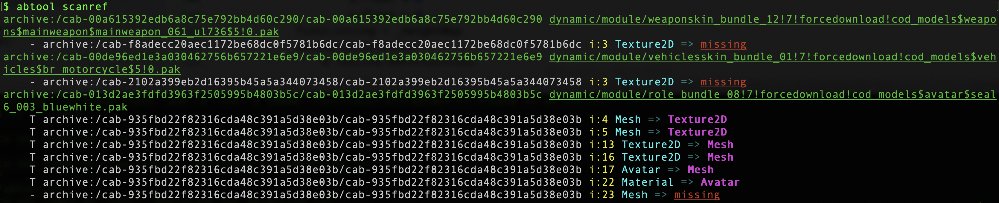

# scanref
---

#### 用途

`scanref`命令通过扫描ab资源的对象之间的引用关系来识别资源引用的有效性，同时会把扫描结果缓存到当前目录的`assets.ref`文件。

#### 参数

|参数|缩写|描述|
|:-|:-:|:-|
|--artifact|-a|缓存文件路径，默认：`assets.ref`|

#### 示例

```
find . -iname '*.god' | xargs abtool scanref
```

再次运行该命令时可以简化为，当前模式下会自动加载`assets.ref`文件，并打印相关信息，如下。


上图显示，ab资源`scene_guanghanpalace.god`引用了另外一个ab文件`prefabs_effects.god`里面`m_PathID=12602647748065502323`的材质球，但是`prefabs_effects.god`文件里面并没有这个资源。

`missing`状态的资源问题只会导致显示问题，比如紫块、白模等。下图为前文崩溃案例的扫描结果，其主要特征是被引用的资源对象的期望类型与实际类型不符，会导致运行时发生不同类型的强转而导致崩溃。


