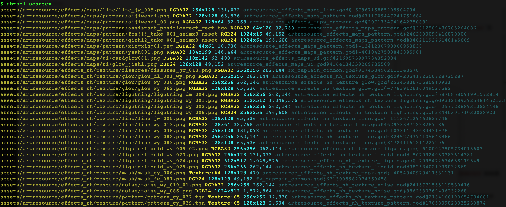
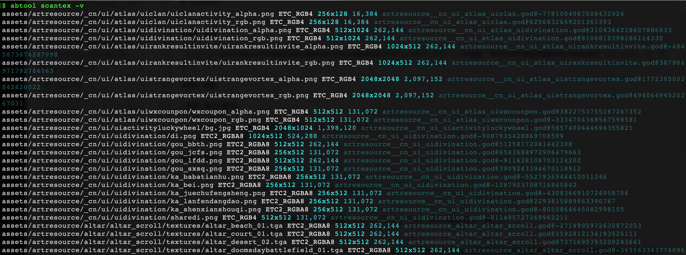

# scantex
---

#### 用途

`scantex`命令扫描ab文件里面包含贴图资源并识别非渲染高效(PVRTC/ASTC/ETC[2])的贴图，同时会把扫描结果缓存到当前目录的`textures.tex`文件。

#### 参数

|参数|缩写|描述|
|:-|:-:|:-|
|--artifact|-a|缓存文件路径，默认：`textures.tex`|
|--verbose|-v|更多日志开关|

#### 示例

```
find . -iname '*.god' | xargs abtool scantex
```

再次运行该命令时可以简化为，当前模式下会自动加载`textures.tex`文件，并打印相关信息，如下。


从上图可以发现有不少`POT`正方形贴图却设置为`RGBA32`格式，这是非常不明智的，因为这种贴图格式的渲染效率很差：占用内存高并且导致渲染发热问题。

另外，该命令在`-v`开关下会输出所有贴图信息，如下。

